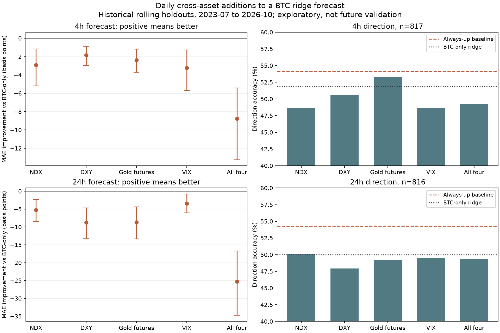

# 跨资产信息能否预测 BTC：第一轮历史研究

**结论：在本次固定线性模型与日频数据口径下，没有发现纳指、DXY、黄金或 VIX 能显著提高 BTC 后续 4 小时／24 小时预测能力。** 这个结论只适用于本实验，不代表所有盘中数据和非线性方法都无效。

本分支基于 `feat/btc-cost-robustness-v0.2.3` 的 `163a1fc`。新增独立研究模块，没有修改原有模拟盘、EMA 策略或交易执行模块。

## 数据与时间口径

BTC/USDT 使用 Binance 公开 4 小时已收盘 K 线，起点 2023-01-01；外部资产使用日频数据，另取一年数据用于指标预热。下载截止时间为 `2026-10-10T00:00:00+00:00`。

| 变量 | 实际输入 | 边界 |
| --- | --- | --- |
| 纳指 | Yahoo `^NDX` | 纳斯达克100日线，未使用 NQ 盘中期货 |
| 美元指数 | Yahoo `DX-Y.NYB` | DXY 日线 |
| 黄金 | Yahoo `GC=F` | 连续黄金期货代理，含换月影响，不是 XAU 现货 |
| VIX | CBOE 官方历史 `CLOSE` | 各数据源交易日历可能不同 |

日线的日期只作为交易日标签，不能当作当天凌晨已知的价格。所有外部日线统一延迟至**次日纽约时间 00:01** 才可用，随后在第一个 BTC 4 小时边界（本样本为 08:00 UTC）预测；按纽约时区处理夏令时。向后匹配可用观察，超过 96 小时即剔除。每个纳指交易日只生成一次观察，周五信息可以用于周六，周日／周一不重复复制同一日线。

BTC 特征只读入场前一根已完成 K 线；预测目标为入场开盘价至 4／24 小时后的开盘价收益。外部日线并无逐历史时点的发布／修订版本，因此延迟规则降低偷看风险，却不能证明供应商每个历史版本当时都已发布。

## 固定实验

- 基线：零收益预测、训练期平均收益预测、仅 BTC 岭回归；方向额外比较始终预测上涨。
- BTC 特征：过去 4 小时、24 小时、7 天对数收益，以及 7 天收益波动。
- 每种外部资产增加：1／5 个实际观察日收益、20 个观察日波动和数据年龄；分别单独增加，再联合增加。
- 岭回归 L2 系数固定为 10；标准化仅使用训练期，没有参数搜索或依据测试表现选参数。
- 滚动训练 180 个日历日、测试 60 个日历日；标签终点到达测试边界的训练样本全部剔除。4h／24h 各有 20／20 个窗口；部分窗口标记见 fold_boundaries.csv。
- 主指标：相对于仅 BTC 模型，配对绝对预测误差是否降低。10 个观察长度的循环块自助法、2000 次、95% 区间；5 种新增模型 × 2 个预测期限，共 10 项检验使用 Holm 校正。方向、收益和分窗口统计是辅助描述。

| 预测期限 | 对齐总样本 | 滚动测试样本 | 测试观察起止（UTC） |
| --- | ---: | ---: | --- |
| 4 小时 | 941 | 817 | 2023-07-11 至 2026-10-09 |
| 24 小时 | 940 | 816 | 2023-07-11 至 2026-10-08 |

## 方向准确率

| 模型 | 未来 4 小时 | 未来 24 小时 |
| --- | ---: | ---: |
| 仅 BTC | 51.90% | 50.00% |
| BTC + 纳指 | 48.59% | 50.12% |
| BTC + DXY | 50.55% | 47.92% |
| BTC + 黄金期货 | 53.24% | 49.26% |
| BTC + VIX | 48.59% | 49.51% |
| BTC + 全部资产 | 49.20% | 49.39% |
| 始终预测上涨 | 54.10% | 54.29% |

方向准确率不是盈利概率。上涨样本比例约 54%，因此不能只用 50% 作为成功门槛。

## 平均误差与窗口稳定性

MAE 单位为基点，1 基点 = 0.01 个收益率百分点；改善值为‘BTC 单独误差减新增模型误差’，**负值表示更差**。95% 区间是未做多重校正的块自助区间，检验门槛另看 Holm 校正 p 值。

| 期限 | 模型 | MAE（bp） | 较 BTC 改善（bp） | 改善 95% 区间 | 误差改善窗口数 |
| --- | --- | ---: | ---: | --- | ---: |
| 4h | 仅 BTC | 53.48 | — | — | — |
| 4h | BTC + 纳指 | 56.39 | -2.92 | [-5.20, -1.16] | 4/20 |
| 4h | BTC + DXY | 55.33 | -1.86 | [-2.97, -0.87] | 3/20 |
| 4h | BTC + 黄金期货 | 55.86 | -2.38 | [-3.72, -1.20] | 6/20 |
| 4h | BTC + VIX | 56.70 | -3.23 | [-5.69, -1.26] | 4/20 |
| 4h | BTC + 全部资产 | 62.25 | -8.78 | [-13.24, -5.42] | 3/20 |
| 24h | 仅 BTC | 158.62 | — | — | — |
| 24h | BTC + 纳指 | 163.89 | -5.28 | [-8.46, -2.31] | 4/20 |
| 24h | BTC + DXY | 167.34 | -8.72 | [-13.19, -4.67] | 5/20 |
| 24h | BTC + 黄金期货 | 167.25 | -8.63 | [-13.35, -4.37] | 4/20 |
| 24h | BTC + VIX | 162.06 | -3.44 | [-6.04, -0.78] | 8/20 |
| 24h | BTC + 全部资产 | 183.87 | -25.25 | [-34.76, -16.78] | 3/20 |

通过主检验的新增模型／期限组合共有 0 个。不能把个别窗口更好或个别指标更高解释成稳定优势；零收益预测的 MAE 见 forecast_summary.csv，更多特征也可能增加估计噪声。



## 相关性为何不能直接用于预测

以下为全样本探索性相关系数：外部资产上一观察日收益分别与 BTC 入场前 24 小时收益、入场后的收益比较。前者不是完全同步的美国交易时段相关性，**没有因果或独立测试意义**。

| 外部资产 | BTC 前 24h | BTC 后 4h | BTC 后 24h |
| --- | ---: | ---: | ---: |
| NDX | 0.286 | 0.011 | -0.051 |
| DXY | -0.107 | -0.071 | -0.061 |
| GOLD | 0.056 | 0.039 | 0.007 |
| VIX | -0.258 | 0.018 | 0.032 |

纳指和 VIX 与 BTC 已发生的走势关系比较明显，但与后续走势的相关性接近零。到次日才使用的日频信息可能已经被市场消化；这是一种解释，不是本实验已经验证的机制。

## 含成本的持有诊断

每个模型／期限单独模拟：预测收益超过对应成本场景的双边成本门槛才买入，固定投入当时资金的 30%，持有到目标开盘后卖出。交易不重叠，不混合两种期限。这个简化模型**没有原 EMA 引擎的 ATR 止损、风险定仓或回撤熔断**，所以不是原策略的收益或风险评估。零成本是不可执行的上限场景；不同成本场景会改变入场次数。

| 模型 | 期限 | 零成本收益 | 10bp 费 + 5bp 滑点／单边 | 双倍成本收益 |
| --- | --- | ---: | ---: | ---: |
| 仅 BTC | 4h | 10.65% | -0.45% | -1.23% |
| 仅 BTC | 24h | 8.59% | -9.20% | -6.90% |
| BTC + 全部资产 | 4h | 10.95% | -8.24% | -5.67% |
| BTC + 全部资产 | 24h | 10.91% | -11.08% | -24.93% |

这些是同一批历史预测的探索性诊断，不能作为未来收益承诺，也不能按当前小额人民币账户直接套用。

## 局限与后续研究

此实验只检验日频外部数据在次日固定时点的简单线性增量信息；不是每根 BTC 4 小时 K 线都预测，也不覆盖全部周末环境。历史数据曾用于策略开发，测试窗口虽按时间分开，仍是已查看历史上的探索性滚动验证。自助法不能消除结构变化、多个窗口反复拟合和数据供应商修订的影响。

下一轮应单独取得带明确收盘／发布时间的 NQ、DXY、VIX 盘中数据，用同一 UTC 时钟对齐，再固定模型检验 4 小时领先性；波动率／风险状态预测也应另立目标。新增实验需明确标注为后续探索，不能继续在这些已查看窗口调参后称为未触碰测试。最终优势必须在新增未来模拟盘时段检验。

## 复现与文件

```bash
python -m btc_quant.cross_asset_data --start 2023-01-01 --end 2026-10-10T00:00:00
python -m btc_quant.cross_asset --directory data/market/cross-asset --output-dir outputs/cross-asset
python -m btc_quant.cross_asset_report --directory outputs/cross-asset --destination docs/research/cross-asset
python -m pytest -q
```

重新下载时供应商历史数据可能变化，先比较 `methodology.json` 中 SHA-256。当前结果的运行环境及完整配置也记录于此。

- `forecast_summary.csv`：总体误差、方向、配对区间及 Holm 检验。
- `fold_metrics.csv` / `fold_boundaries.csv`：窗口稳定性和训练标签边界。
- `aligned_samples_4h.csv` / `aligned_samples_24h.csv`：每个入场时点的实际可用特征审计。
- `oos_predictions.csv`：逐样本真实收益与各模型历史预测，可独立复算。
- `availability_audit.csv`：各资产观察年龄与跨日历沿用次数。
- `descriptive_correlations.csv`：探索性相关性。
- `toy_cost_sensitivity.csv`：简化持有诊断的成本敏感性。

数据源： [Binance public market data](https://github.com/binance/binance-public-data)、[Yahoo Finance](https://finance.yahoo.com/)、[CBOE VIX 官方历史数据](https://www.cboe.com/tradable-products/vix/vix-historical-data/)。机制参考：[CME 的 BTC 与股票相关性研究](https://www.cmegroup.com/insights/economic-research/2025/why-is-bitcoin-moving-in-tandem-with-equities.html)。相关性研究本身不证明领先预测能力。
